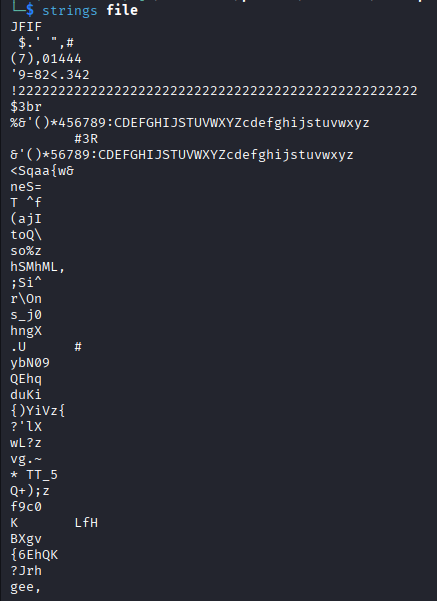
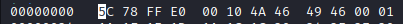
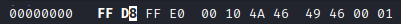
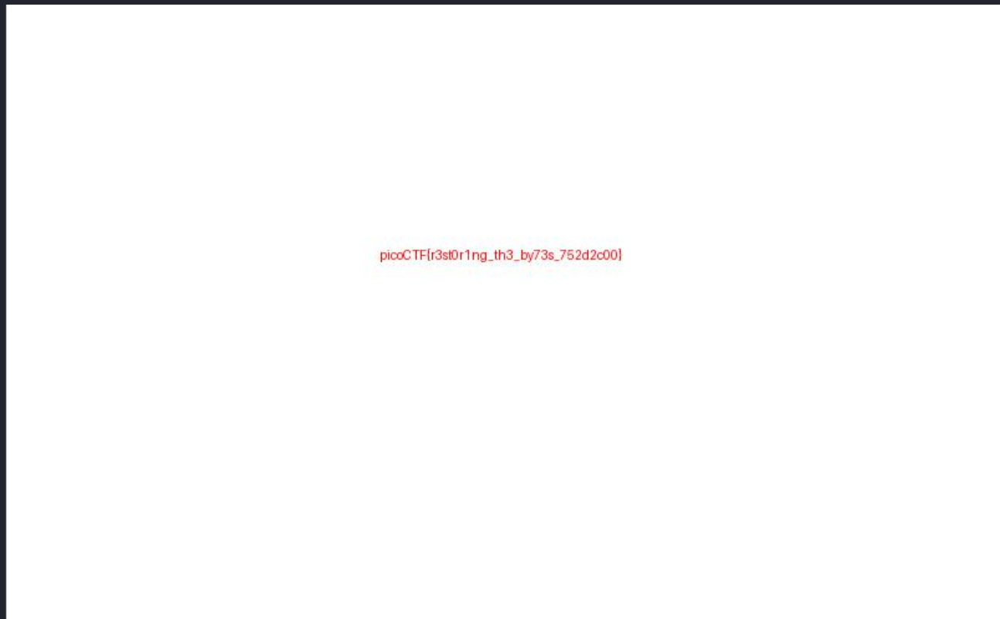

# Corrupted File
**Category:** Forensics
**Difficulty:** Easy

## 📝 Description
*This file seems broken... or is it? Maybe a couple of bytes could make all the difference. Can you figure out how to bring it back to life? Download the file here.*

## File:
* file: data 

## Investigation:
Let's start to check the given file. using *strings*.



Here we can see that this file is a JFIF file. A JFIF (JPEG File Interchange Format) file is a standard format for storing JPEG-compressed images, essentially an older or more detailed version of the common JPG/JPEG, used to ensure compatibility across different devices and software. So it is the same with JPG or JPEG. Let's try to add .jpeg extension and try to open it.


Here we got an error. It says "Error interpreting JPEG image file (Not a JPEG file: starts with 0x5c 0x78)". So there is a problem with the magic number. A magic number (or file signature) is a specific sequence of bytes at the beginning of a file that acts as a unique identifier for its file format. This allows computer systems and software to determine the file's true type, regardless of its extension or MIME type, which can be easily changed or faked. 



So it corrupt because of the magic number. For JFIF, the magic number must be: 

```
FF D8 FF E0 00 10 4A 46 49 46 00 01
```
To recover the file, we just need to fix the first 2 byte from "5C 78" into "FF D8". I use hexedit to change it.



Let's open it again.



There it is. So the flag is **picoCTF{r3st0r1ng_th3_by73s_752d2c00}**.