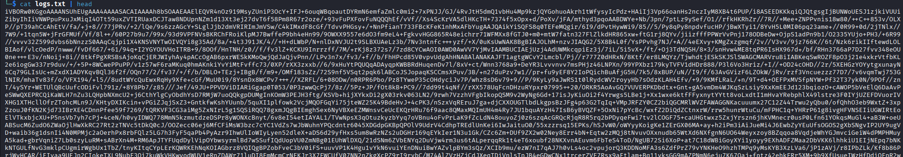
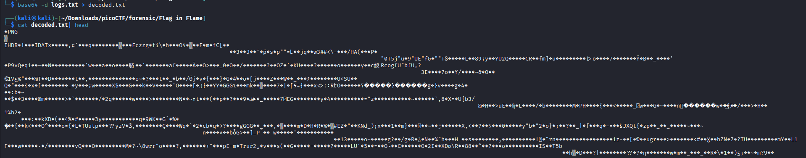
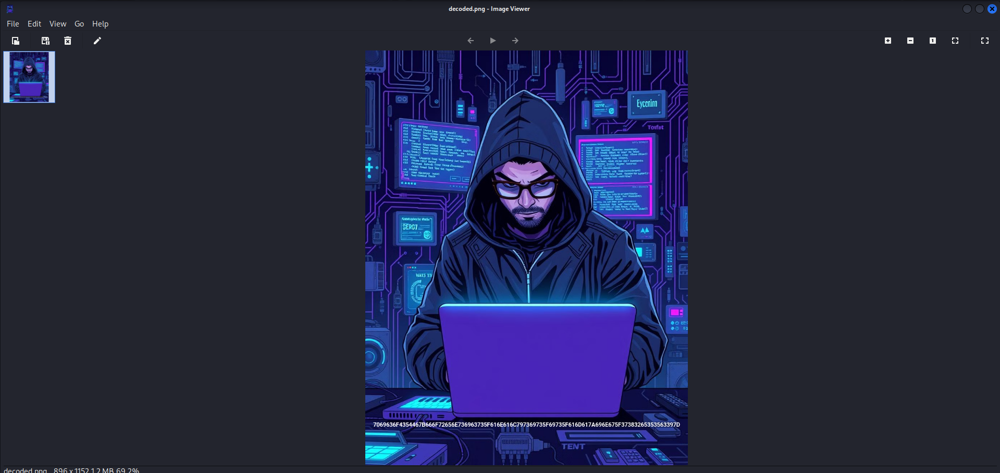
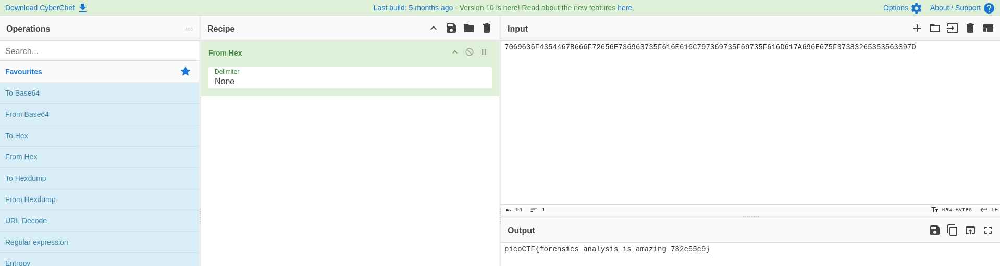

# Flag in Flame
**Category:** Forensics
**Difficulty:** Easy

## 📝 Description
*The SOC team discovered a suspiciously large log file after a recent breach. When they opened it, they found an enormous block of encoded text instead of typical logs. Could there be something hidden within? Your mission is to inspect the resulting file and reveal the real purpose of it. The team is relying on your skills to uncover any concealed information within this unusual log.*
*Download the encoded data here: Logs Data. Be prepared—the file is large, and examining it thoroughly is crucial.*

## File:
* logs.txt

## Investigation:
Let's open the logs.txt file first.

Looks like we got a long base64 string. Let's try to decode it.

By decoding the base64 string, it gave us a PNG file. Let's change the filetype into .png and check what picture is this.

There we can see a bunch of hex,"7069636F4354467B666F72656E736963735F616E616C797369735F69735F616D617A696E675F37383265353563397D". Let's try to convert it using "CyberChef".

There it is, when we converted the hex, we got the flag **picoCTF{forensics_analysis_is_amazing_782e55c9}**.
