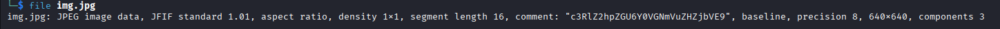
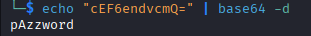
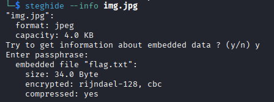
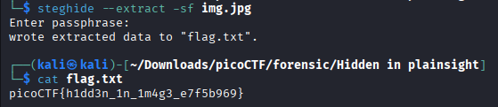

# Hidden in plainsight
**Category:** Forensics
**Difficulty:** Easy

## 📝 Description
*You’re given a seemingly ordinary JPG image. Something is tucked away out of sight inside the file. Your task is to discover the hidden payload and extract the flag.*
*Download the jpg image here.*

## File:
* img.jpg


## Investigation:
As starting, i check the file given using *file*.



As we can see, there is a base64 string in the comment field. Let's decode it using the next command.

```
echo "c3RlZ2hpZGU6Y0VGNmVuZHZjbVE9" | base64 -d
```


The decoded string give us the next clue "steghide:cEF6endvcmQ=". Steghide is a command-line steganography utility used to hide and extract data within image and audio files. We also got a base64 string again. Let's decode it first.



Here we got a password **pAzzword**. Let's check the img.jpg using steghide.



It ask us to enter a passphrase. By using **pAzzword**, we can see that there is a file, flag.txt, embedded inside the img.jpg. Let's extract it.



There it is, the flag is **picoCTF{h1dd3n_1n_1m4g3_e7f5b969}**.