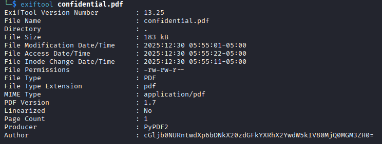
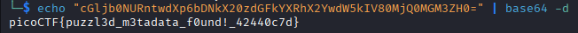

# Riddle Registry
**Category:** Forensics
**Difficulty:** Easy

## 📝 Description
*Hi, intrepid investigator! 📄🔍 You've stumbled upon a peculiar PDF filled with what seems like nothing more than garbled nonsense. But beware! Not everything is as it appears. Amidst the chaos lies a hidden treasure—an elusive flag waiting to be uncovered.*
*Find the PDF file here Hidden Confidential Document and uncover the flag within the metadata.*

## File:
* Confidential.pdf


## Investigation:
This is just a simple stegano challenge where the author hide the flag within the metadata, as it said in the description. So, all we need to do is check the metadata using *exiftool*.



As we can see, on the Author field we found a base64 string. so we can decode it using 
```
echo "cGljb0NURntwdXp6bDNkX20zdGFkYXRhX2YwdW5kIV80MjQ0MGM3ZH0=" | base64 -d
```


There it is, the flag is **picoCTF{puzzl3d_m3tadata_f0und!_42440c7d}**.