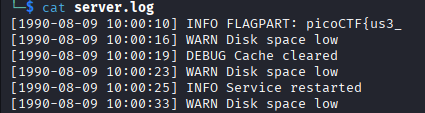
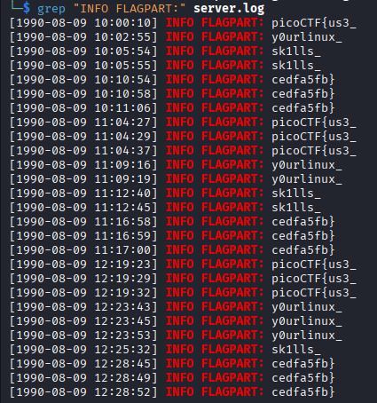
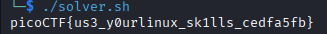

# Log Hunt
**Category:** General Skills
**Difficulty:** Easy

## 📝 Description
*Our server seems to be leaking pieces of a secret flag in its logs. The parts are scattered and sometimes repeated. Can you reconstruct the original flag? Download the logs and figure out the full flag from the fragments.*

## File:
* server.log


## Investigation:
In this challenge, we asked to analyze a linux server log. I start analyze by seeing what inside the log and i found something interesting.



Here we get field **INFO FLAGPART:**. I assume that all flag part is having it. Let's get all of **INFO FLAGPART:** using *grep*.



Nice, we got all part of the flag. Now all we have to do is reconstruct the flag. I make a script to automatically reconstruct it.

```
#!/bin/bash

grep "INFO FLAGPART:" server.log | sed 's/.*FLAGPART: //' | awk '!seen[$0]++' | tr -d '\n' | echo "$(cat)"
```


So the flag is **picoCTF{us3_y0urlinux_sk1lls_cedfa5fb}**.
