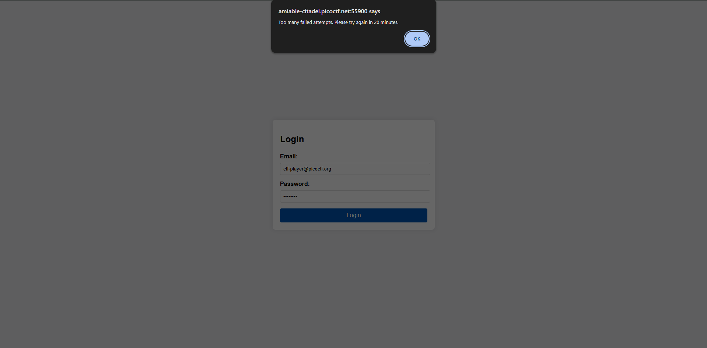
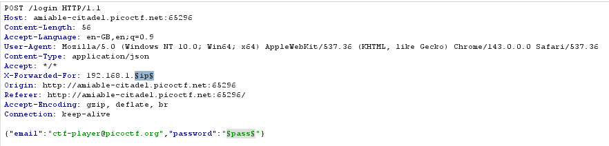
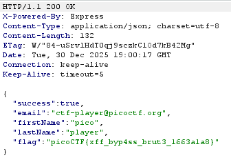

# Crack The Gate 2
**Category:** Web Exploitation
**Difficulty:** Medium

## Description
*The login system has been upgraded with a basic rate-limiting mechanism that locks out repeated failed attempts from the same source. We’ve received a tip that the system might still trust user-controlled headers. Your objective is to bypass the rate-limiting restriction and log in using the known email address: ctf-player@picoctf.org and uncover the hidden secret.*
*The website is running here. Can you try to log in?.*
*Download the passwords list here.*

## Analysis:
We are given a login page and we asked to login with the known email and some password to try within **password.txt**. I try to input all of the password that given. But we have a problem here, the website has rate-limiting. So it block us to send request many request on the short time.

Rate-limiting is a strategy for limiting traffic. It works by give limit for each IP Address to send request. So if the client already sent request more than the limit, it will blocked for sending more request. In this case, each IP Address only able to send one request. If more, the server will return an error alert "Too many failed attempts. Please try again in 20 minutes". To bypass this by using X-Forward-For on the request header. So the server will think that the request was sent by different IP Address.

## Exploit:
To exploit, we just need to add **X-Forward-For:** into the HTTP request header.

Here we just change the "ip" for each request and do the dictionary attack to the "pass".

There it is. The flag is **picoCTF{xff_byp4ss_brut3_1663a1a8}**.